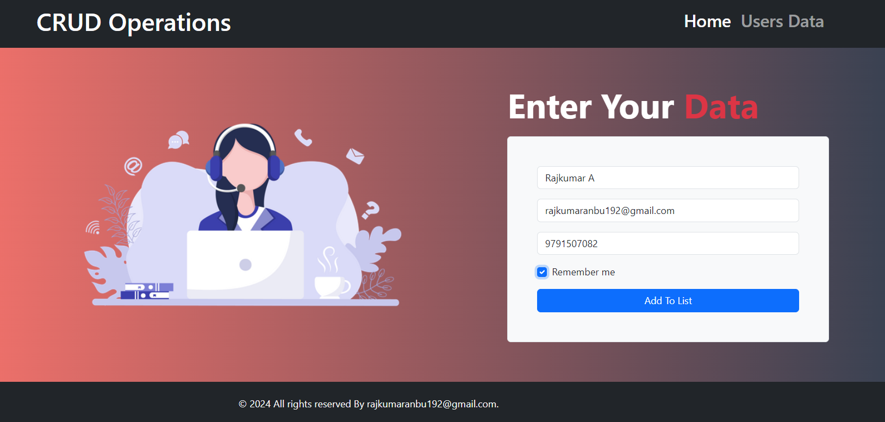
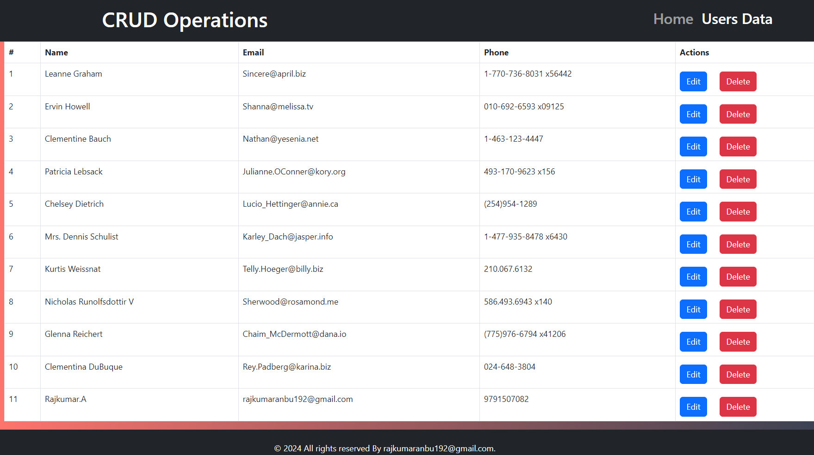

# React Axios CRUD Operation.

This project is a React application that demonstrates CRUD operations with user data using Axios to interact with a mock API. The application allows users to view, add, edit, and delete user records from a mock API.

1. User interface of the CRUD application showcases its layout and design elements
   


---

2. Edit interface enables CRUD operations, allowing users to modify fetched data.
   


---


## Mock API

- **API URL**: [https://jsonplaceholder.typicode.com/users](https://jsonplaceholder.typicode.com/users)

  
## Features

- **Display Users**: Fetch and display all existing users from the API.
- **Add User**: Add new user records to the API.
- **Edit User**: Update existing user records.
- **Delete User**: Remove user records from the API.
- **Responsive Design**: Clean and responsive UI for easy navigation and use.

## Technologies Used

- **React**: JavaScript library for building user interfaces.
- **Axios**: HTTP client for making requests to the mock API.
- **CSS**: For styling the application.

## Installation

1. **Clone the Repository**
   ```bash
   git clone https://github.com/RAJKUMAR-35/React-Axios-CRUD-Operation

2. **Navigate to the project directory:**
   ```bash
   cd React-Axios-CRUD-Operation

3. **cd react-shopping-cart:**
   ```bash
   npm install

4. **Start the development server:**
   ```bash
   npm run dev
   
## Development Process

- **Initial Setup**: Created React app and set up Axios.
- **Fetch Data**: Implemented data fetching and display from the mock API.
- **CRUD Operations**: Added functionality for adding, editing, and deleting user records.
- **Responsive Design**: Styled the application for responsiveness and user-friendly interaction.

## Conclusion

This React application showcases how to perform CRUD operations using Axios to interact with a mock API. It emphasizes a clean, responsive design and an intuitive user experience.

---
## Contact

For any inquiries or feedback, please contact:
- Email: rajkumaranbu192@gmail.com
- LinkedIn: [Rajkumar A](https://www.linkedin.com/in/rajkumar-cse/)


